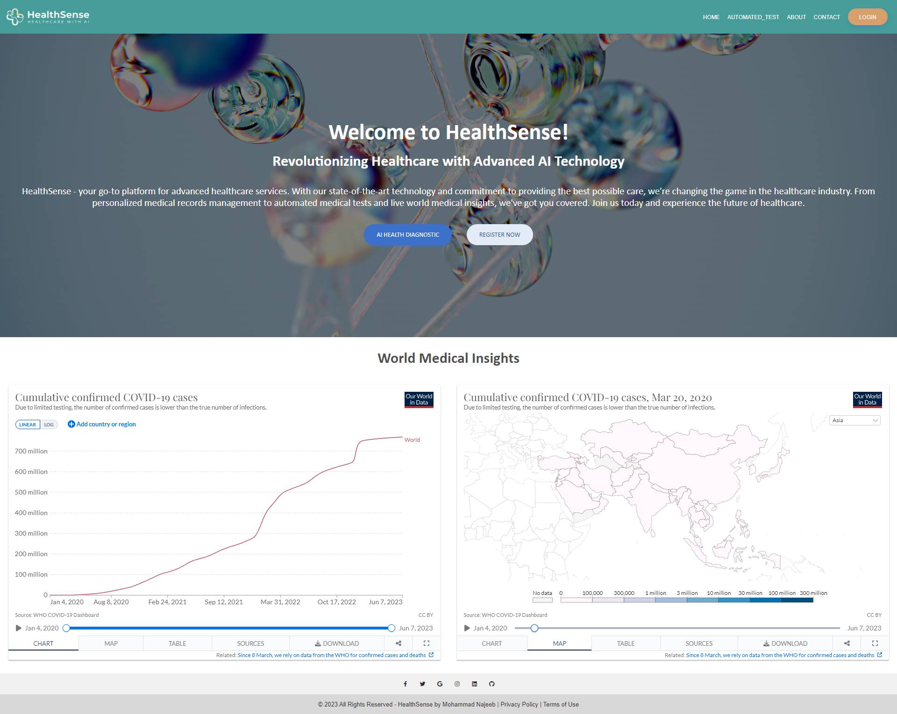
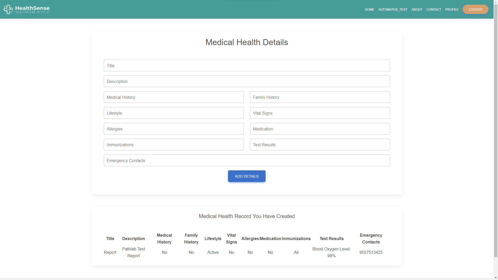
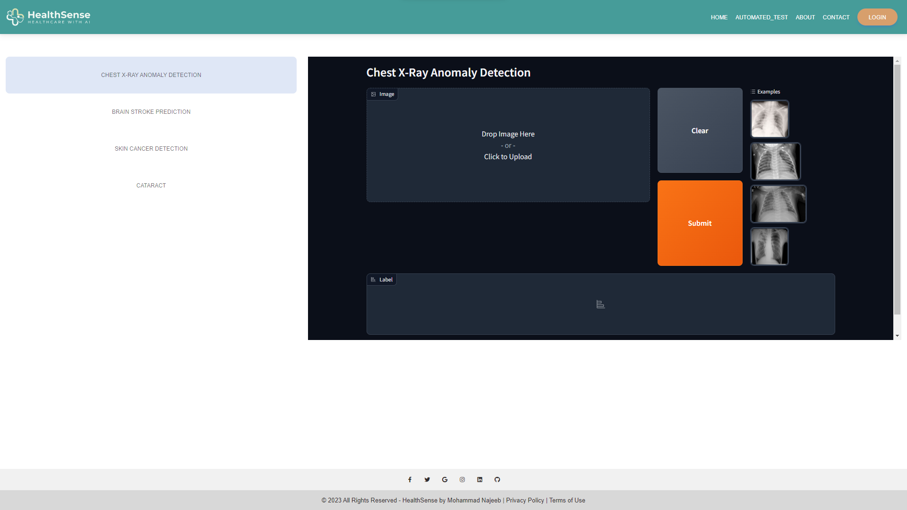

# AI HealthSense Website

## Table of Contents

- [Introduction](#introduction)
- [Features](#features)
- [Prerequisites](#prerequisites)
- [Installation](#installation)
- [Usage](#usage)
- [Screenshots](#screenshots)
- [Contributing](#contributing)
- [License](#license)

## Introduction

AI HealthSense Website is a web application that provides automated AI-based medical diagnosis and live global medical insights. It allows users to manage their profiles, upload medical health data, and receive AI-driven analysis and recommendations. The goal of this project is to enhance healthcare services and provide users with valuable insights about their health.

## Features

- User registration and login
- Profile management
- Automated AI medical diagnosis
- Live global medical insights
- Secure data handling
- User-friendly interface

## Prerequisites

Before you begin, ensure that you have the following prerequisites installed:

- Node.js (version 12 or higher)
- npm (Node Package Manager)
- MongoDB (running instance)

## Installation

1. Clone the repository:

   ```bash
   git clone https://github.com/your-username/ai-healthsense-website.git


2. Navigate to the project directory:

   ```bash
   cd ai-healthsense-website
   ```

3. Install the dependencies:

   ```bash
   npm install
   ```

4. Create a `.env` file in the root directory and provide the following configurations:

   ```
   PORT=3000
   DATABASE_URL=mongodb://localhost:27017/ai_healthsense
   JWT_SECRET=your-secret-key
   ```

5. Start the server:

   ```bash
   npm start
   ```

6. Open a web browser and visit `http://localhost:3000` to access the AI HealthSense website.

## Usage

- Register a new user account.
- Log in with your credentials.
- Upload your medical health data.
- View AI-based diagnosis and recommendations.
- Explore live global medical insights.

## Screenshots


*Figure 1: Homepage of AI HealthSense website*


*Figure 2: User registration page*


*Figure 3: User login page*


*Figure 4: User profile page*


*Figure 5: Medical test upload page*

## Contributing

Contributions are welcome! Please follow these guidelines when contributing to the project:

- Fork the repository.
- Create a new branch for your feature or bug fix.
- Commit your changes with descriptive commit messages.
- Push your branch to your forked repository.
- Submit a pull request to the main repository.

## License

This project is licensed under the [MIT License](LICENSE).
```
